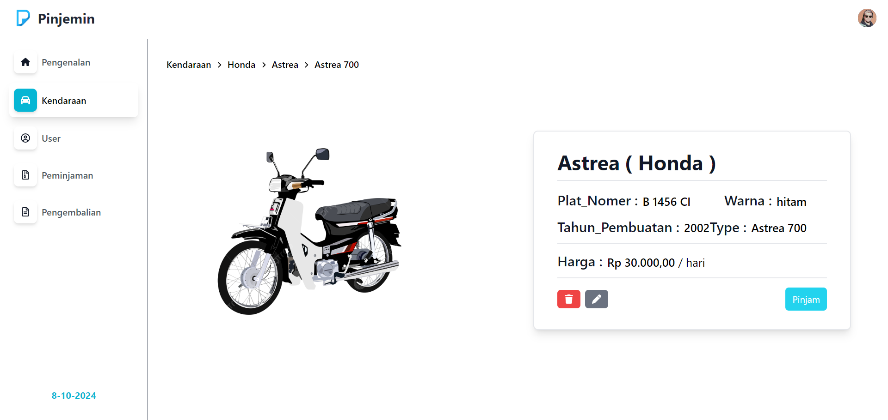
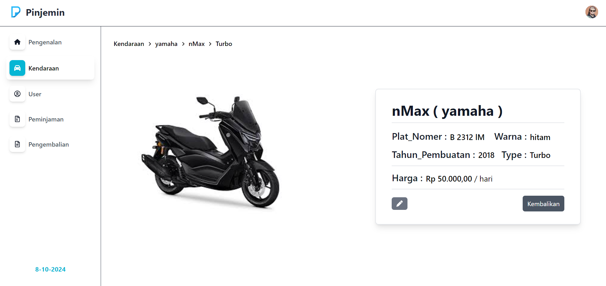
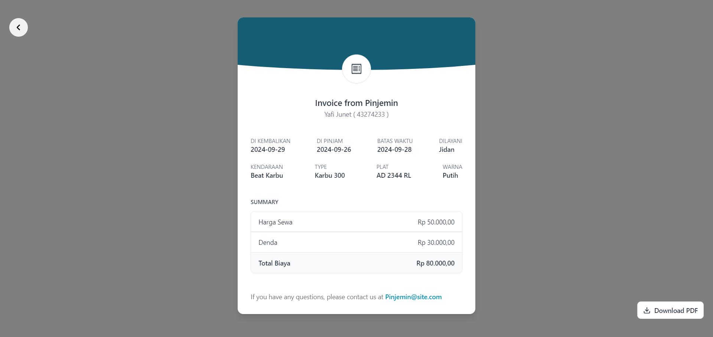

# WEBSITE PEMINJAMAN KENDARAAN
<br>

## Deskripsi Projek 

**Sistem Peminjaman Kendaraan** adalah sebuah Website responsif yang dirancang untuk memudahkan pengelolaan data Peminjaman Kendaraan dan sistem approval yang dapat diakses admin dan user/client menggunakan React JS. Website ini memungkinkan Admin untuk memanage data peminjaman dengan lebih cepat dan efisian secara ofline (dengan data user yang telah tersedia) atau mengelola peminjaman secara online dengan user melakukan login dan meminta request, lalu admin menerima atau menolak.


## Dependecies / Teknologi yang digunakan

1. **React**

    Library / Framework JS

    ```bash
   npx create-react-app (nama Folder)
    ```

2. **axios**

    Untuk Melakukan Pemasangan Service API

    ```bash
    npm i axios
    ```

3. **react-icons**

    Pendukung Icon

    ```bash
    npm i react-icons
    ```

4. **react-router-dom**

    Pembuatan Routing

    ```bash
    npm i react-router-dom
    ```
5. **moment**

    Perhitungan Waktu 

    ```bash
    npm i moment
    ```
6. **html2canvas & jspdf**

    Menyeleksi dan Melakukan Convert ke Bentuk PDF

    ```bash
    npm i html2canvas jspdf
    ```
7. **react-select**

    Digunakan Untuk Pembuatan Input Select

    ```bash
    npm i react-select
    ```
8. **tailwind**

    utility UI

    [tailwind](https://tailwindcss.com/docs/guides/create-react-app)


    <br>
    

## Strukture Folder
**FrontEnd**
<br/>
--**public** 
<br/>
--**src** 
<br/>
  ----**components** ( untuk Membuat component yang reusable )
<br/>
  ----**image** ( menyimpan aset aset gambar )
<br/>
  ----**landingPageComp** ( membuat component untuk landing page )
<br/>
  ----**service** ( membuat file meyimpan logic consum api )
<br/>
  ----**template** ( Membuat file template )
<br/>
  ----**user** ( file main untuk user side / client side )


## Note
Data user = Data Client
<br/>
basename routernya = `/UTS-Syahreza_Imam_Wahyudi-FE/`
<br>


<br>


## Hal Yang Berkaitan


- **Landing Page**


- **Login Register**
1. login register Admin


1.Login User


- **Dashboard Admin**








--private resource hanya untuk Admin dengan role pemilik


- **Dashboard User**
<br/>
-- isi menu kendaraan sama seperti menu kendaran di dashboard admin
<br/>
--menu peminjaman dan pengembalian hanya berisi rekap data diri user pribadi


<br>


## Kontribusi

Jika Anda ingin berkontribusi pada projek ini, silakan lakukan pull request dengan perubahan yang Anda inginkan. Pastikan perubahan Anda sesuai dengan tujuan dan struktur projek ini.

```
    Buat Code Disini
```

<br>

## Kontak

- **Nama:** Syahreza Imam Wahyudi
- **Email:** [syahrezaimamwahyudi976@gmail.com](mailto:syahrezaimamwahyudi976@gmail.com)
- **Website:** [www.https://github.com/Syahrezaimamw.com](https://github.com/Syahrezaimamw)

<br>


 


